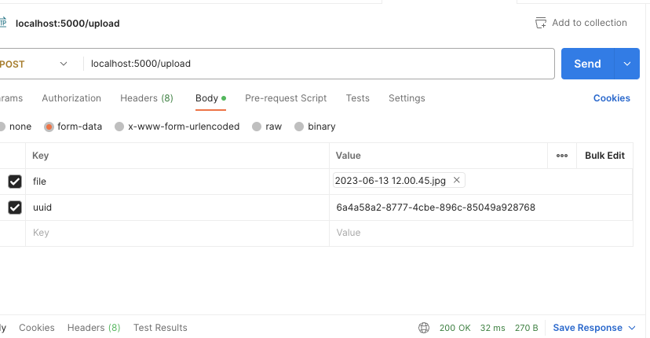

# DATA STORIES

The development of the backend of Data Stories

## API examples

http://localhost:5000/create_new

http://localhost:5000/delete?ds=6a4a58a2-8777-4cbe-896c-85049a928768

http://localhost:5000/get_item?ds=6a4a58a2-8777-4cbe-896c-85049a928768

http://localhost:5000/get_data_stories

### Upload files with webform

Open `test.html` adapt the uuid in the hidden field. Use it.

### Upload files test with Postman

http://localhost:5000/upload

POST 

Two conventions:
- the name of the upload field `file` 
- hidden field `uuid` with value of the uuid of the datastoy

### Upload files with Curl

curl --location 'localhost:5000/upload' \
--form 'file=@"/Users/mvdpeet/Desktop/test.wav"' \
--form 'uuid="6a4a58a2-8777-4cbe-896c-85049a928768"'

curl --location 'localhost:5000/upload' --form 'file=@"<ABSOLUTE PATH>"' --form 'uuid="<UUID"'

Doesn't always work. Probably more headers needed. Later...

